# TakdaOps V1 Entity Relationship Diagram

This ERD includes the existing authentication/tenant foundation and all proposed V1 business tables. Infrastructure-only Laravel cache and queue tables are omitted.

## Mermaid ER diagram

```mermaid
erDiagram
    ORGANIZATIONS {
        bigint id PK
        varchar name
        varchar status
    }
    USERS {
        bigint id PK
        bigint organization_id FK
        varchar name
        varchar email UK
        varchar password
    }
    BUSINESS_SETTINGS {
        bigint id PK
        bigint organization_id FK
        varchar display_name
        char currency
        varchar booking_prefix
        varchar quotation_prefix
        varchar billing_prefix
    }
    DOCUMENT_SEQUENCES {
        bigint id PK
        bigint organization_id FK
        varchar document_type
        smallint year
        bigint next_number
    }

    CUSTOMERS {
        bigint id PK
        bigint organization_id FK
        varchar name
        boolean is_active
    }
    EVENT_TYPES {
        bigint id PK
        bigint organization_id FK
        varchar name
        boolean is_active
    }
    SERVICES {
        bigint id PK
        bigint organization_id FK
        varchar name
        int total_units
        boolean is_active
    }
    PACKAGES {
        bigint id PK
        bigint organization_id FK
        bigint service_id FK
        varchar name
        boolean is_active
    }
    SERVICE_RATES {
        bigint id PK
        bigint organization_id FK
        bigint event_type_id FK
        bigint package_id FK
        int duration_minutes
        decimal unit_rate
        boolean is_active
    }
    STAFF {
        bigint id PK
        bigint organization_id FK
        varchar name
        varchar phone
        boolean is_active
    }

    BOOKINGS {
        bigint id PK
        bigint organization_id FK
        bigint customer_id FK
        bigint event_type_id FK
        varchar booking_number UK
        date event_date
        varchar status
        bigint created_by FK
    }
    BOOKING_SERVICES {
        bigint id PK
        bigint organization_id FK
        bigint booking_id FK
        bigint service_id FK
        bigint package_id FK
        datetime start_at
        datetime end_at
        int duration_minutes
        int quantity
        decimal unit_rate
        decimal line_total
    }
    BOOKING_SERVICE_STAFF_ASSIGNMENTS {
        bigint id PK
        bigint organization_id FK
        bigint booking_service_id FK
        bigint staff_id FK
        bigint assigned_by FK
        datetime assigned_at
    }
    BOOKING_RESCHEDULES {
        bigint id PK
        bigint organization_id FK
        bigint booking_id FK
        date previous_event_date
        date new_event_date
        bigint changed_by FK
        datetime changed_at
    }
    BOOKING_RESCHEDULE_ITEMS {
        bigint id PK
        bigint booking_id FK
        bigint booking_reschedule_id FK
        bigint booking_service_id FK
        datetime previous_start_at
        datetime previous_end_at
        datetime new_start_at
        datetime new_end_at
    }

    QUOTATIONS {
        bigint id PK
        bigint organization_id FK
        bigint booking_id FK
        varchar quotation_number UK
        varchar status
        date valid_until
        decimal subtotal
        decimal transportation_fee
        decimal crew_meal_fee
        decimal discount_amount
        decimal total
        bigint created_by FK
    }
    QUOTATION_ITEMS {
        bigint id PK
        bigint booking_id FK
        bigint quotation_id FK
        bigint booking_service_id FK
        datetime start_at
        datetime end_at
        int duration_minutes
        int quantity
        decimal unit_rate
        decimal line_total
    }

    PAYMENTS {
        bigint id PK
        bigint organization_id FK
        bigint quotation_id FK
        decimal amount
        varchar payment_method
        datetime paid_at
        varchar status
        bigint created_by FK
        bigint voided_by FK
    }
    BILLINGS {
        bigint id PK
        bigint organization_id FK
        bigint quotation_id FK
        varchar billing_number UK
        datetime issued_at
        decimal subtotal
        decimal transportation_fee
        decimal crew_meal_fee
        decimal discount_amount
        decimal total
        bigint created_by FK
    }
    BILLING_ITEMS {
        bigint id PK
        bigint quotation_id FK
        bigint billing_id FK
        bigint quotation_item_id FK
        int duration_minutes
        int quantity
        decimal unit_rate
        decimal line_total
    }

    ORGANIZATIONS ||--|| USERS : "has one admin"
    ORGANIZATIONS ||--|| BUSINESS_SETTINGS : "has settings"
    ORGANIZATIONS ||--o{ DOCUMENT_SEQUENCES : "allocates numbers"

    ORGANIZATIONS ||--o{ CUSTOMERS : "owns"
    ORGANIZATIONS ||--o{ EVENT_TYPES : "owns"
    ORGANIZATIONS ||--o{ SERVICES : "owns"
    ORGANIZATIONS ||--o{ PACKAGES : "owns"
    ORGANIZATIONS ||--o{ SERVICE_RATES : "owns"
    ORGANIZATIONS ||--o{ STAFF : "owns"
    SERVICES ||--o{ PACKAGES : "defines"
    EVENT_TYPES ||--o{ SERVICE_RATES : "prices"
    PACKAGES ||--o{ SERVICE_RATES : "has rates"

    ORGANIZATIONS ||--o{ BOOKINGS : "owns"
    CUSTOMERS ||--o{ BOOKINGS : "books"
    EVENT_TYPES ||--o{ BOOKINGS : "classifies"
    USERS ||--o{ BOOKINGS : "creates"
    BOOKINGS ||--|{ BOOKING_SERVICES : "contains"
    SERVICES ||--o{ BOOKING_SERVICES : "reserves capacity"
    PACKAGES ||--o{ BOOKING_SERVICES : "snapshots package"
    BOOKING_SERVICES ||--o{ BOOKING_SERVICE_STAFF_ASSIGNMENTS : "has assignments"
    STAFF ||--o{ BOOKING_SERVICE_STAFF_ASSIGNMENTS : "is assigned"
    USERS ||--o{ BOOKING_SERVICE_STAFF_ASSIGNMENTS : "assigns"
    BOOKINGS ||--o{ BOOKING_RESCHEDULES : "records changes"
    USERS ||--o{ BOOKING_RESCHEDULES : "changes"
    BOOKING_RESCHEDULES ||--|{ BOOKING_RESCHEDULE_ITEMS : "contains deltas"
    BOOKINGS ||--o{ BOOKING_RESCHEDULE_ITEMS : "scopes deltas"
    BOOKING_SERVICES ||--o{ BOOKING_RESCHEDULE_ITEMS : "tracks schedule"

    ORGANIZATIONS ||--o{ QUOTATIONS : "owns"
    BOOKINGS ||--o{ QUOTATIONS : "has revisions"
    USERS ||--o{ QUOTATIONS : "creates"
    QUOTATIONS ||--|{ QUOTATION_ITEMS : "snapshots"
    BOOKINGS ||--o{ QUOTATION_ITEMS : "scopes sources"
    BOOKING_SERVICES ||--o{ QUOTATION_ITEMS : "is source for"

    ORGANIZATIONS ||--o{ PAYMENTS : "owns"
    QUOTATIONS ||--o{ PAYMENTS : "receives"
    USERS ||--o{ PAYMENTS : "records or voids"
    ORGANIZATIONS ||--o{ BILLINGS : "owns"
    QUOTATIONS ||--o| BILLINGS : "produces at most one"
    USERS ||--o{ BILLINGS : "creates"
    BILLINGS ||--|{ BILLING_ITEMS : "contains"
    QUOTATIONS ||--o{ BILLING_ITEMS : "scopes sources"
    QUOTATION_ITEMS ||--o| BILLING_ITEMS : "is source for"
```

The Mermaid attributes are intentionally concise. Snapshot columns, audit columns, generated quotation slots, and exact composite constraints are specified in [DOMAIN_MODEL.md](./DOMAIN_MODEL.md).

## Relationship map by domain

### Authentication and tenant foundation

- One Organization has exactly one Admin User operationally. The current unique User foreign key enforces at most one; transactional registration creates both together.
- One Organization has one Business Settings row and many year/type Document Sequences.
- The authenticated User is the only source of tenant context.

### Master data

- Organization owns Customers, Event Types, Services, Packages, Service Rates, and Staff.
- Service has many Packages; each Package belongs to exactly one Service.
- Event Type plus Package plus duration identifies one Service Rate. Service is derived from Package.

### Booking, scheduling, and audit

- Booking belongs to one Customer and one Event Type and contains one or more Booking Services.
- Booking Service belongs to one Service and one Package; the database must ensure that Package belongs to that Service.
- Booking Service has zero or more optional Staff assignments.
- A confirmed Booking has zero or more immutable Reschedule headers, each with one or more per-Booking-Service schedule deltas.

### Commercial

- Booking has many retained Quotation revisions but at most one Draft/Sent quotation and at most one Accepted quotation.
- Quotation has one or more immutable items copied from Booking Services.

### Financial

- An Accepted Quotation has zero or more Payments and at most one Billing.
- Billing has one or more Billing Items copied from accepted Quotation Items.
- Paid amount and balance derive from POSTED Payments; no mutable balance table or columns exist.

## Domain boundaries not represented as tables

Calendar and Dashboard are read models over Booking, Booking Service, Staff assignment, Quotation, Payment, and Billing data. They do not require V1 persistence tables. Availability is calculated transactionally from Service capacity and overlapping Booking Services; it is not cached as inventory rows.
